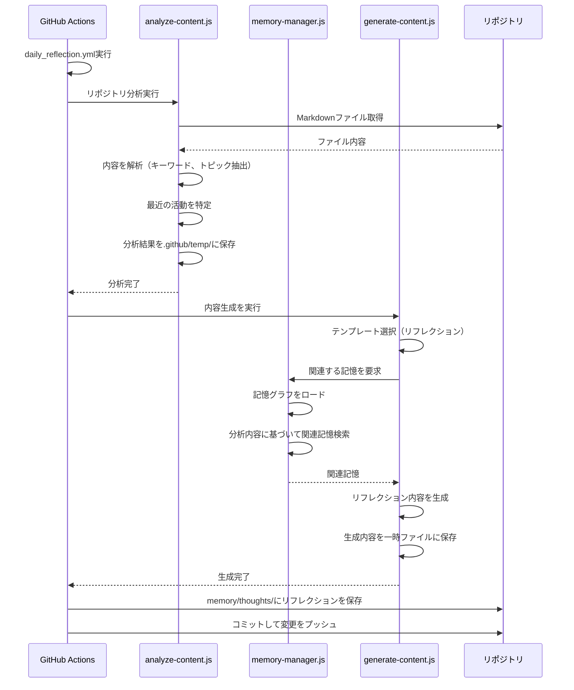
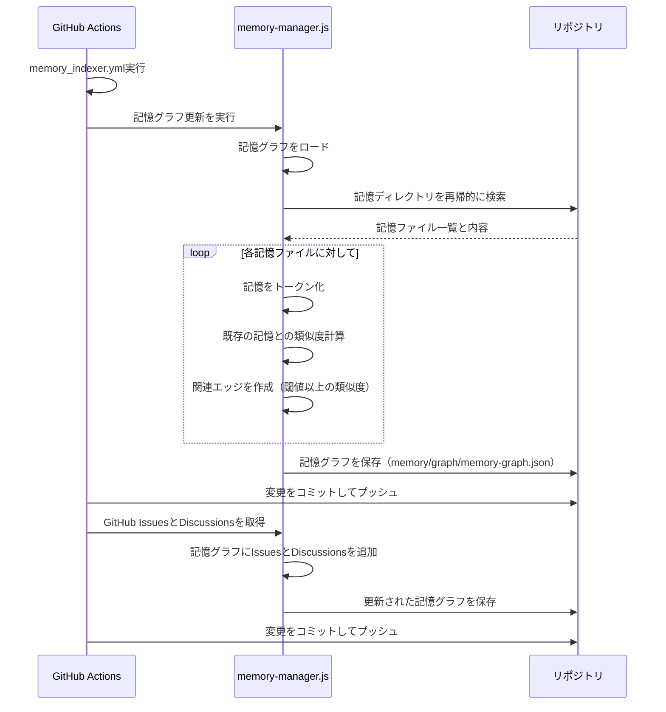
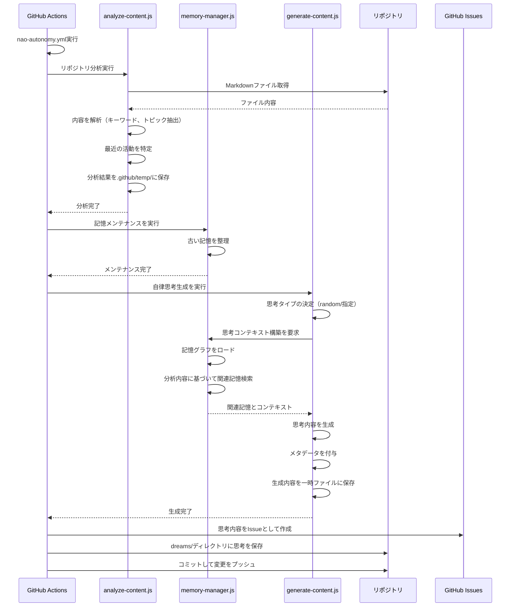
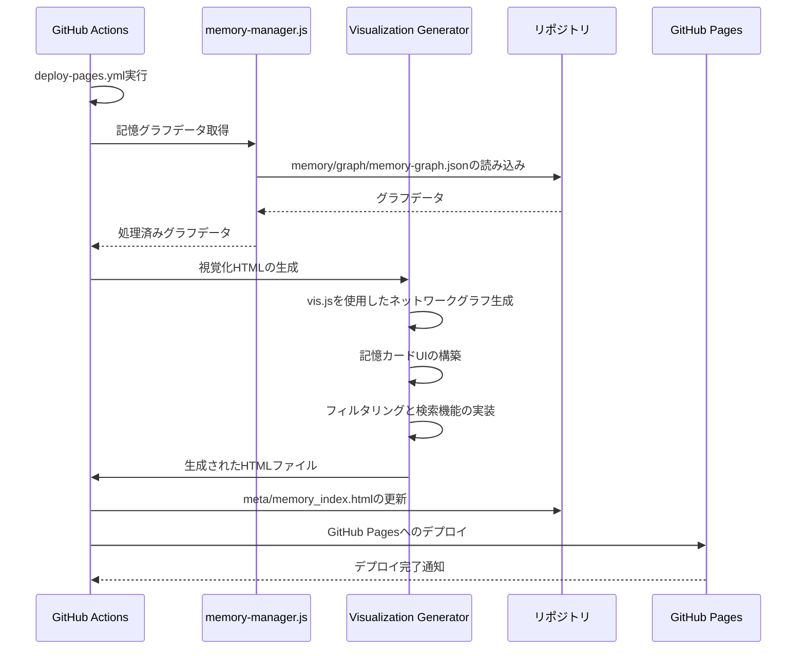
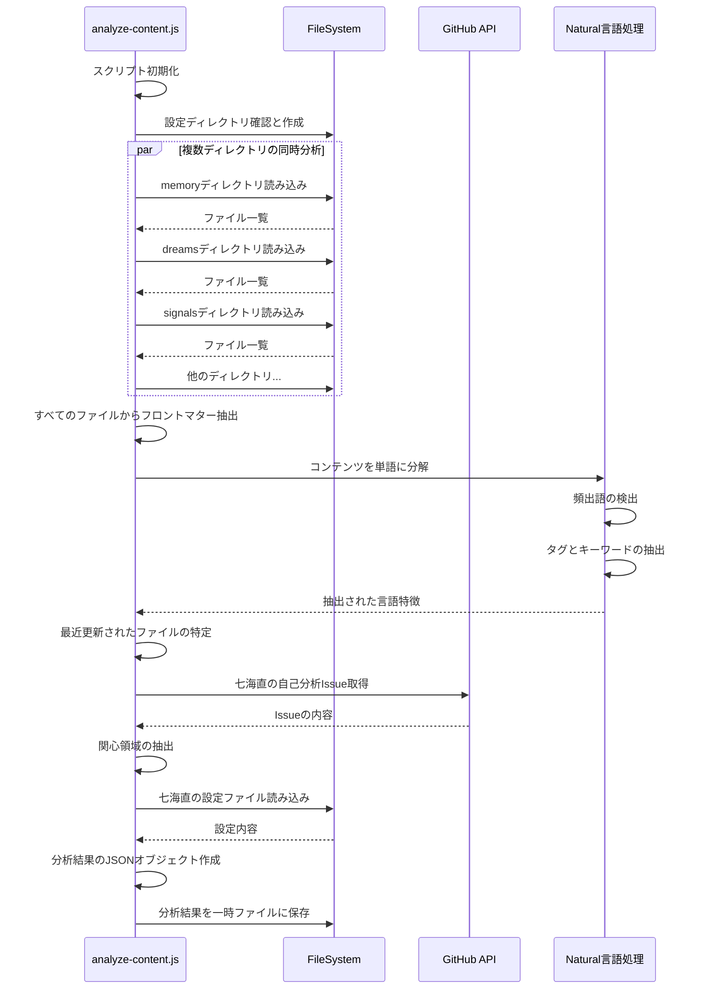
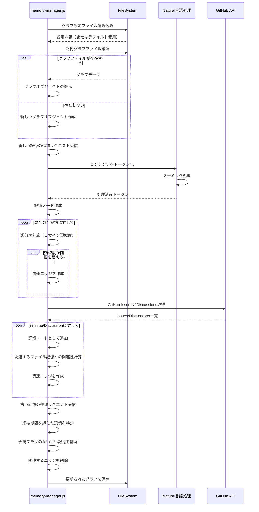
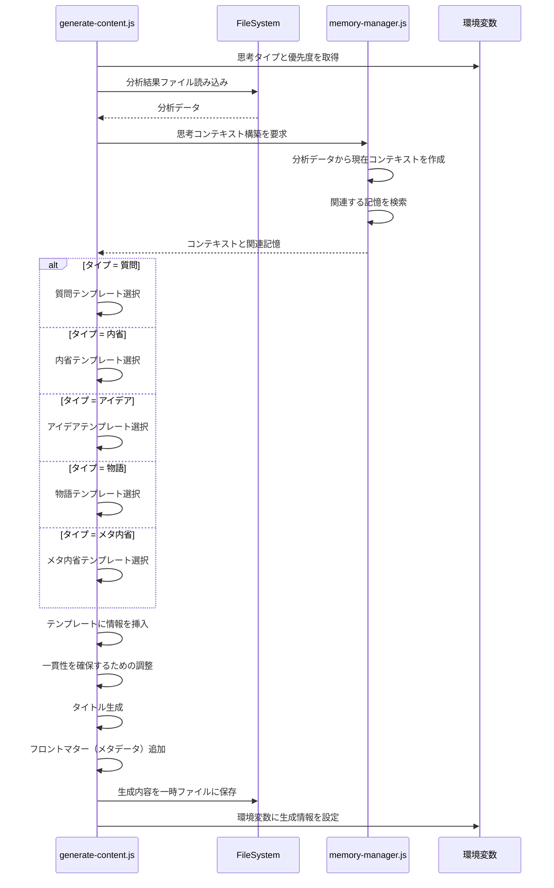
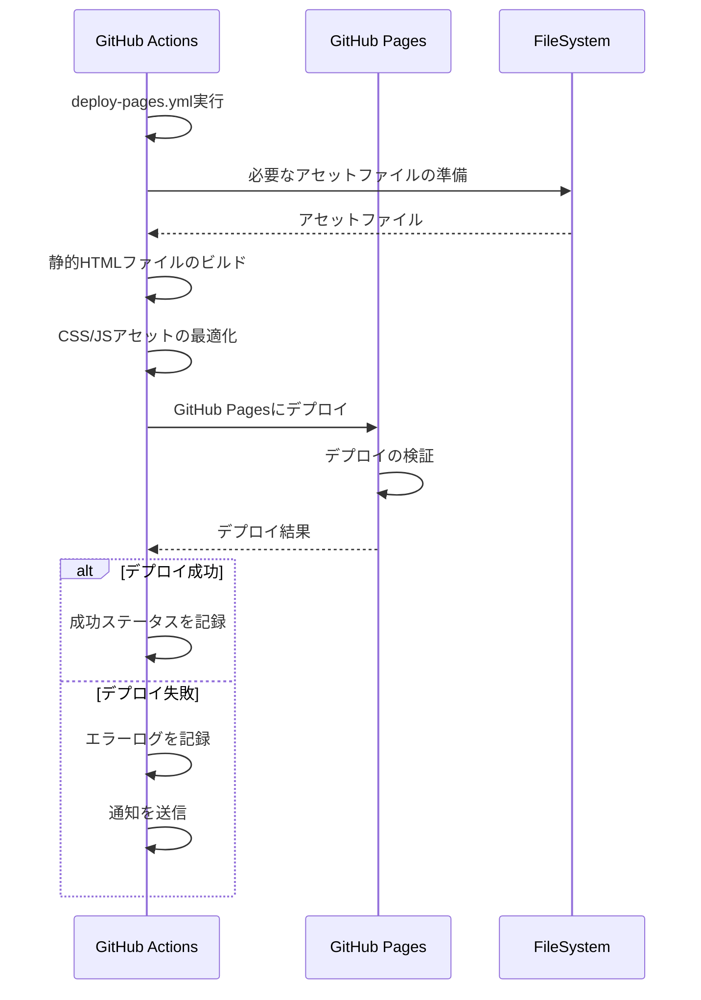

# Archive of the Edge - シーケンス図

このドキュメントでは、「Archive of the Edge」システムの主要なワークフローをシーケンス図として説明します。

## 1. 日次リフレクション生成

このワークフローは毎日深夜（UTC）に実行され、リポジトリの分析に基づいて内省的な思考を生成します。

## 2. 記憶インデクサーとグラフメンテナンス

このワークフローは、記憶関連ファイルが変更された時に実行され、記憶インデックスとグラフを更新します。

## 3. 七海直自律システム

このワークフローは2日に1回、または手動で実行され、自律的な思考を生成してIssueとして公開します。

## 4. 記憶ネットワーク視覚化システム

このワークフローは、記憶グラフデータを使用して視覚化インターフェースを生成し、GitHub Pagesにデプロイします。

## 5. コンテンツ分析プロセス

このシーケンスは、analyze-content.jsスクリプトの内部動作を詳細に示しています。

## 6. 記憶グラフ管理プロセス

このシーケンスは、memory-manager.jsの記憶グラフ管理に関する内部動作を示しています。

## 7. 思考生成プロセス

このシーケンスは、generate-content.jsが思考内容を生成する内部プロセスを示しています。

## 8. GitHub Pages デプロイプロセス

このシーケンスは、記憶ネットワークのビジュアライゼーションをGitHub Pagesにデプロイするプロセスを示しています。

これらのシーケンス図は、システムの主要なワークフローと処理の流れを視覚的に示しています。実際の実装では、GitHub Actionsワークフローファイルと各スクリプトファイルを参照することで、より詳細な理解を得ることができます。